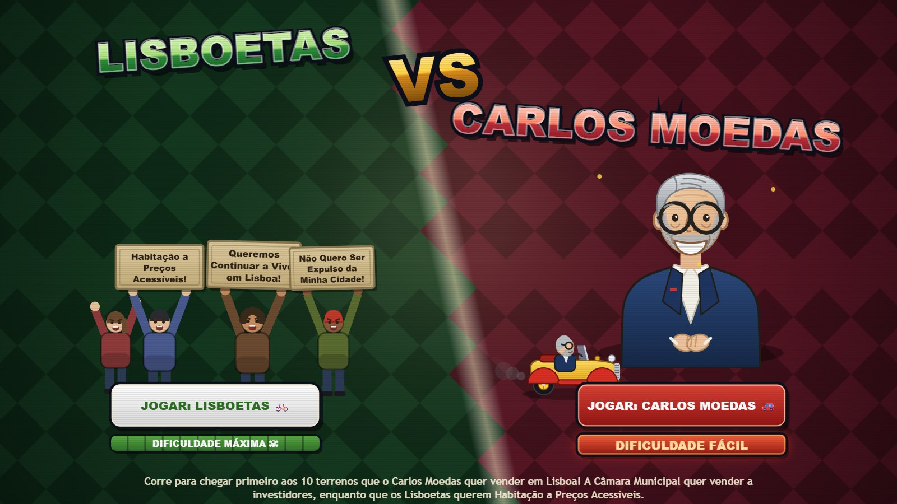

# Lisboetas VS Carlos Moedas 🚲🆚🚗

Corre para chegar primeiro aos 10 terrenos que o **Carlos Moedas** quer vender em Lisboa! A Câmara Municipal quer vender a investidores, enquanto que os **Lisboetas** (de bicicleta Gira) querem Habitação a Preços Acessíveis.

## 🎮 Jogar

**Online:** https://politicalgames74.github.io/Carlos-Moedas-Vende-Terrenos/

**Local:** basta abrir o `index.html` num browser. Sem dependências, sem build — um único ficheiro HTML.

## 🕹️ Controlos

- **Setas** — mover
- **Espaço** — avançar cutscenes
- **ESC** — menu de pausa (continuar, música on/off, sair para o menu)
- **Toque** — arrasta num dos cantos de baixo para conduzir (serve destros e canhotos)

O menu principal tem um ecrã **Como Jogar** com as regras todas.

## ✨ Características

- Lisboa procedural: Marquês de Pombal, Torre de Belém, Castelo de S. Jorge, estádios, Aqueduto, Amoreiras, Basílica da Estrela, Ponte 25 de Abril…
- Dois lados jogáveis: Lisboetas (**Dificuldade MÁXIMA** — bateria fraca e docas Gira avariadas) ou Moedas (**Dificuldade FÁCIL** — o camião de gás nunca o deixa ficar mal)
- Obstáculos de rua bem lisboetas: buracos no alcatrão e pilhas de sacos de lixo, que custam 2 segundos parado
- Aos 5 terrenos perdidos, Moedas visita a *Fábrica de Unicórnios* 🦄🌈
- PWA instalável: funciona offline e em ecrã inteiro (`manifest.json` + service worker)
- Joga-se ao alto ou deitado; em ecrã estreito a câmara afasta-se para caber mais cidade

## 📦 Publicar no GitHub Pages

1. Criar repositório e fazer push de todos os ficheiros
2. **Settings → Pages → Deploy from a branch** → `main` / `/ (root)`
3. O link fica ativo em ~1 minuto

---

*Paródia/sátira política sem afiliação. Nenhum autarca foi ferido durante o desenvolvimento (só chorou um bocadinho, em fonte).* 
